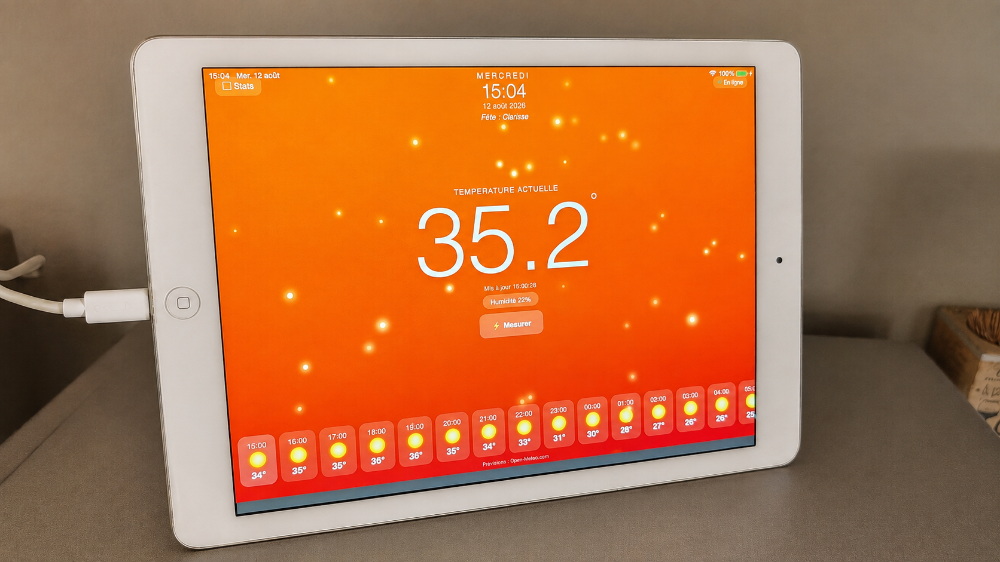
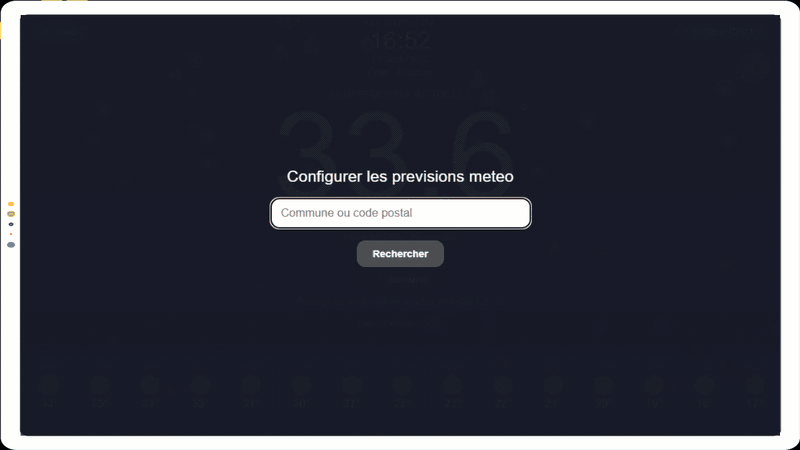
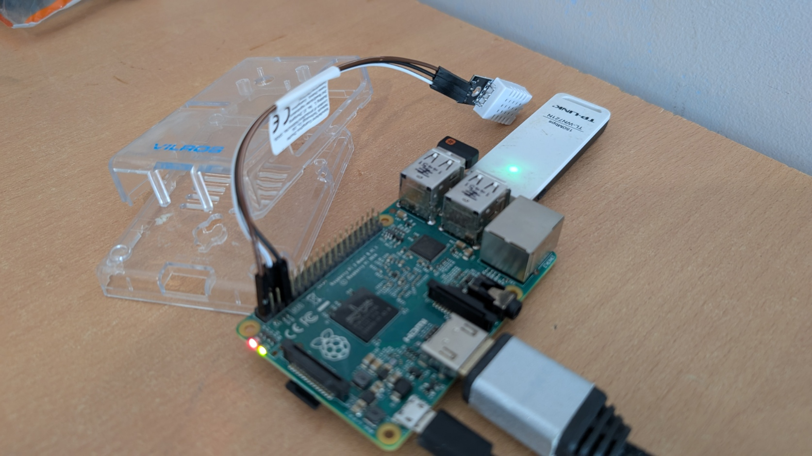
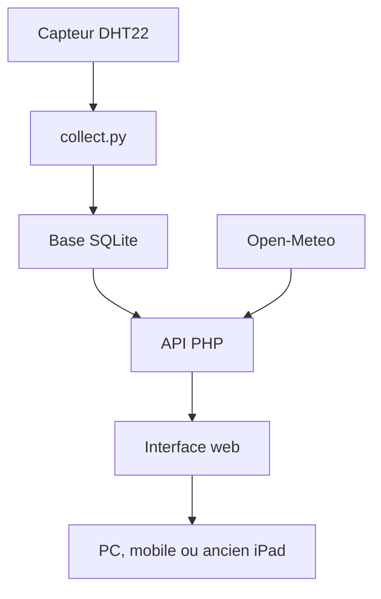
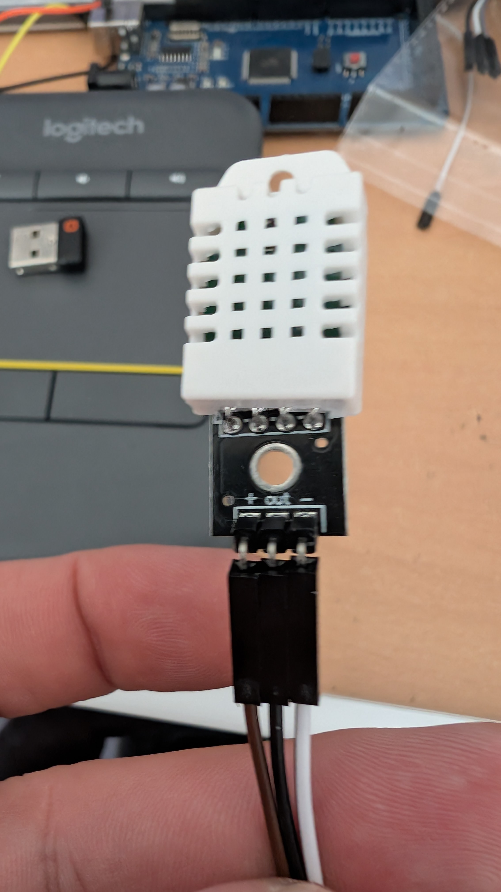
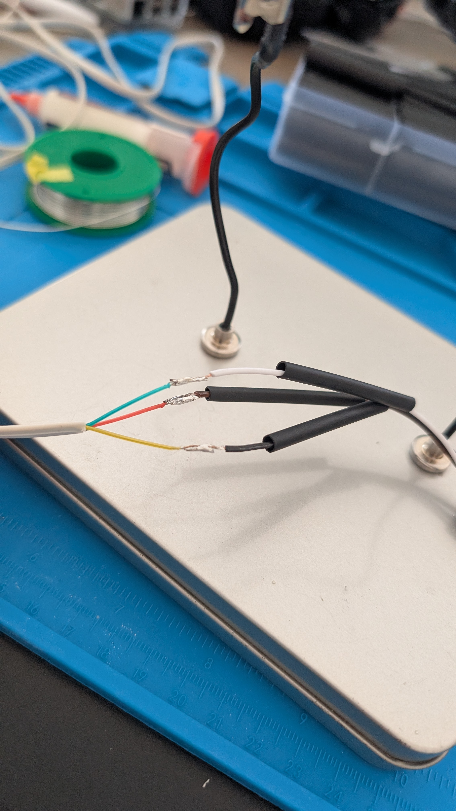
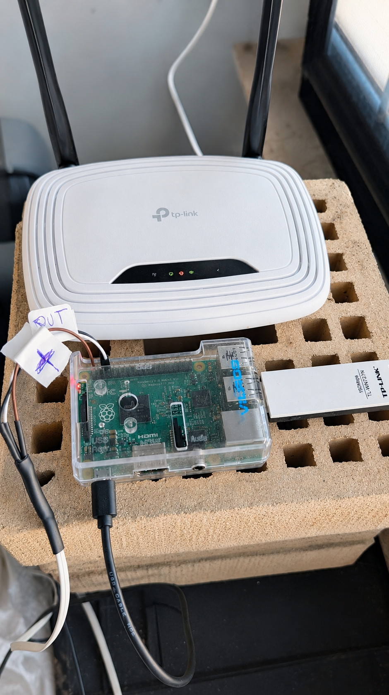
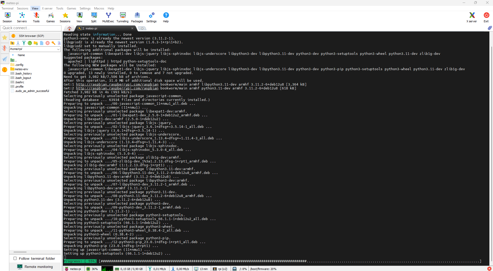

# Station météo Raspberry Pi avec du matériel de récupération

Une station météo locale construite autour d’un ancien **Raspberry Pi 2B**, d’un capteur **DHT22 / AM2302** et d’un **iPad Air sous iOS 12.5.7** réutilisé comme écran permanent.

L’objectif était simple : transformer du matériel qui dormait dans les tiroirs — Raspberry Pi, clé Wi-Fi, câble téléphonique, boîtier et tablette — en un objet réellement utile.



## Démonstration



## Fonctionnalités

- mesure locale de la température et de l’humidité avec un DHT22 ;
- collecte automatique environ toutes les 5 minutes ;
- stockage des mesures dans une base SQLite ;
- mesure instantanée à la demande, sans l’enregistrer dans l’historique ;
- statistiques sur 24 heures et graphiques sur 24 heures, 7 jours et 30 jours ;
- prévisions horaires fournies par Open-Meteo ;
- choix de la commune au premier lancement ;
- bouton de réinitialisation de la commune ;
- mode nuit automatique selon le lever et le coucher du soleil locaux ;
- animations adaptées à la météo : soleil, nuages, pluie, neige et orage ;
- catégorie d’humidité et calcul du point de rosée ;
- affichage discret de la température du processeur du Raspberry Pi ;
- interface tactile compatible avec Safari sous iOS 12.5.7 ;
- aucun compte en ligne et aucune clé API nécessaires.

> Les mesures et l’historique sont hébergés localement. Les prévisions et les horaires solaires nécessitent toutefois une connexion Internet vers Open-Meteo.

## Matériel utilisé

| Élément | Utilisation |
|---|---|
| Raspberry Pi 2 Model B | Serveur, acquisition et stockage |
| Carte microSD 32 Go | Système et base SQLite |
| DHT22 / AM2302 sur module | Température et humidité |
| Ancien câble téléphonique d’environ 5 m | Déport du capteur extérieur |
| Clé Wi-Fi USB TP-Link | Connexion réseau du Raspberry Pi 2B |
| Boîtier transparent | Protection du Raspberry Pi |
| Ancien iPad Air, iOS 12.5.7 | Écran tactile de la station |
| Gaine thermorétractable et fils | Isolation des raccordements |



## Principe de fonctionnement



Le service `meteo.service` exécute `collect.py` en permanence. Le script lit le capteur sur le GPIO 4, puis ajoute une mesure à SQLite environ toutes les cinq minutes. Apache et PHP exposent les données sous forme de JSON à l’interface web.

Le bouton **Mesurer** utilise `live_read.py`. Cette lecture met immédiatement l’écran à jour, mais elle n’est volontairement pas enregistrée : les statistiques restent basées uniquement sur les mesures automatiques.

## Branchement du DHT22

Le module utilisé possède trois broches : `+`, `OUT` et `−`.

| DHT22 | Raspberry Pi | Broche physique | Rôle |
|---|---|---:|---|
| `+` / VCC | 3,3 V | 1 | Alimentation |
| `OUT` / DATA | GPIO 4 | 7 | Données |
| `−` / GND | GND | 6 | Masse |



Le module DHT22 visible sur les photos intègre déjà son électronique de support. Vérifiez néanmoins le marquage de votre propre module : l’ordre des broches peut varier selon le fabricant.

### Préparation du câble récupéré

L’ancien câble téléphonique permet d’éloigner le capteur du Raspberry Pi. Trois conducteurs suffisent : alimentation, données et masse.


Les raccords sont soudés, puis chaque conducteur est isolé avec de la gaine thermorétractable.


Le repérage `+`, `OUT` et `−` évite toute inversion lors du branchement final.


### Côté Raspberry Pi




## Installation extérieure

Le capteur doit être placé :

- à l’ombre ;
- à l’abri de la pluie directe ;
- dans un endroit ventilé ;
- loin d’un mur, d’une toiture ou d’un appareil qui accumule de la chaleur.

Ici, il est installé sous un avant-toit. Cette solution reste artisanale : pour obtenir des mesures météorologiques de référence, utilisez un véritable abri à coupelles ou un abri Stevenson.


Le Raspberry Pi reste à l’intérieur, près du point d’accès Wi-Fi.



## Structure du dépôt

```text
.
├── README.md
├── LICENSE
├── .gitignore
├── requirements.txt
├── web/
│   ├── index.html
│   ├── charts.html
│   ├── app.js
│   ├── api.php
│   └── .htaccess
├── scripts/
│   ├── collect.py
│   └── live_read.py
├── service/
│   └── meteo.service
├── database/
│   └── schema.sql
├── config/
│   └── location.example.json
└── docs/
    └── images/
```

## Installation depuis zéro

Les commandes ci-dessous supposent :

- Raspberry Pi OS Bookworm ;
- un utilisateur nommé `rpi` ;
- le dépôt copié dans `/home/rpi/station-meteo`.

Si votre utilisateur ou vos chemins diffèrent, adaptez `api.php`, les scripts Python et `meteo.service`.

### 1. Préparer Raspberry Pi OS

Installez Raspberry Pi OS, activez SSH et configurez le réseau. Connectez-vous ensuite au Raspberry Pi :

```bash
ssh rpi@ADRESSE_IP_DU_PI
```

Mettez le système à jour :

```bash
sudo apt update
sudo apt full-upgrade -y
```

### 2. Installer les paquets

```bash
sudo apt install -y apache2 php libapache2-mod-php php-sqlite3 sqlite3 python3-venv python3-pip libgpiod2
```



### 3. Copier le dépôt

Avec Git :

```bash
cd /home/rpi
git clone URL_DE_VOTRE_DEPOT station-meteo
```

Ou copiez manuellement le dossier du projet dans :

```text
/home/rpi/station-meteo
```

### 4. Créer l’environnement Python

```bash
python3 -m venv /home/rpi/meteo-env
/home/rpi/meteo-env/bin/pip install --upgrade pip
/home/rpi/meteo-env/bin/pip install -r /home/rpi/station-meteo/requirements.txt
```

### 5. Installer les scripts et créer la base

```bash
mkdir -p /home/rpi/meteo/data
cp /home/rpi/station-meteo/scripts/collect.py /home/rpi/meteo/
cp /home/rpi/station-meteo/scripts/live_read.py /home/rpi/meteo/
sqlite3 /home/rpi/meteo/data/meteo.db < /home/rpi/station-meteo/database/schema.sql
```

### 6. Appliquer les permissions

Le collecteur, exécuté par `rpi`, doit écrire dans SQLite. Apache, exécuté par `www-data`, doit lire la base et écrire uniquement les fichiers de localisation et de cache dans le dossier `data`.

```bash
sudo chown -R rpi:rpi /home/rpi/meteo
sudo chmod 755 /home/rpi/meteo
sudo chown rpi:www-data /home/rpi/meteo/data
sudo chmod 775 /home/rpi/meteo/data
sudo chown rpi:rpi /home/rpi/meteo/data/meteo.db
sudo chmod 644 /home/rpi/meteo/data/meteo.db
```

Les fichiers `location.json` et `forecast_cache.json` seront créés par PHP lors de l’utilisation.

Autorisez Apache à lire le GPIO pour la mesure instantanée déclenchée depuis l’interface :

```bash
sudo usermod -aG gpio www-data
sudo systemctl restart apache2
```

### 7. Installer le site web

```bash
sudo mkdir -p /var/www/html/meteo
sudo cp -a /home/rpi/station-meteo/web/. /var/www/html/meteo/
sudo chown -R rpi:rpi /var/www/html/meteo
sudo find /var/www/html/meteo -type d -exec chmod 755 {} \;
sudo find /var/www/html/meteo -type f -exec chmod 644 {} \;
```

Activez les en-têtes anti-cache :

```bash
sudo a2enmod headers
```

Dans `/etc/apache2/apache2.conf`, vérifiez que le bloc concernant `/var/www/` autorise le fichier `.htaccess` :

```apache
<Directory /var/www/>
    Options Indexes FollowSymLinks
    AllowOverride All
    Require all granted
</Directory>
```

Puis contrôlez et rechargez Apache :

```bash
sudo apache2ctl configtest
sudo systemctl reload apache2
```

### 8. Installer le service de collecte

```bash
sudo cp /home/rpi/station-meteo/service/meteo.service /etc/systemd/system/meteo.service
sudo systemctl daemon-reload
sudo systemctl enable --now meteo.service
```

Contrôlez son état :

```bash
sudo systemctl status meteo.service --no-pager
```

### 9. Tester le capteur

Lecture instantanée :

```bash
/home/rpi/meteo-env/bin/python3 /home/rpi/meteo/live_read.py
```

Résultat attendu :

```text
OK:23.4:48.7
```

Consultez les journaux de collecte :

```bash
sudo journalctl -u meteo.service -n 50 --no-pager
```

### 10. Ouvrir l’application

Depuis un appareil connecté au même réseau :

```text
http://ADRESSE_IP_DU_PI/meteo/
```

Au premier lancement, saisissez une commune ou un code postal. La recherche Open-Meteo fournit automatiquement les coordonnées et le fuseau horaire. La commune choisie est enregistrée localement dans :

```text
/home/rpi/meteo/data/location.json
```

Ce fichier n’est pas inclus dans le dépôt GitHub.

## Utilisation sur l’ancien iPad

1. Ouvrez l’adresse de la station dans Safari.
2. Utilisez le menu de partage.
3. Choisissez **Sur l’écran d’accueil**.
4. Lancez ensuite l’icône créée.

Les métadonnées `apple-mobile-web-app-capable`, le viewport mobile, `XMLHttpRequest` et les préfixes `-webkit-` assurent la compatibilité avec iOS 12.5.7.

Selon la version exacte de Safari, certaines limites du système peuvent subsister, notamment pour maintenir l’écran allumé en permanence.

## Interface

### Couleurs selon la température

| Température | Apparence |
|---:|---|
| 28 °C ou plus | Rouge/orange, très chaud |
| 24 à 27,9 °C | Orange, chaud |
| 20 à 23,9 °C | Vert, doux |
| 15 à 19,9 °C | Bleu, frais |
| Moins de 15 °C | Gris bleuté, froid |

### Humidité et point de rosée

L’interface classe l’humidité mesurée :

| Humidité | Indication |
|---:|---|
| Moins de 25 % | Air très sec |
| 25 à 39 % | Air sec |
| 40 à 60 % | Humidité modérée |
| 61 à 75 % | Air humide |
| Plus de 75 % | Air très humide |

Le point de rosée est calculé avec une approximation de Magnus. Cette information indique la température à laquelle de la condensation pourrait commencer à se former.

### Mode nuit

Le mode nuit utilise les heures de lever et de coucher du soleil fournies par Open-Meteo pour la commune choisie. En l’absence de ces données, un horaire de repli entre 21 h et 7 h est utilisé. Le bouton en haut à droite permet aussi de basculer manuellement.

### Température CPU

La pastille d’état affiche également la température du processeur :

- moins de 60 °C : affichage normal ;
- de 60 à 69 °C : avertissement orange ;
- 70 °C ou plus : message `CPU chaud` en rouge.

Cette température n’est ni enregistrée dans SQLite ni ajoutée aux graphiques météo.

### Statistiques

La page `charts.html` affiche :

- les minimum, moyenne et maximum de température sur 24 heures ;
- les minimum, moyenne et maximum d’humidité sur 24 heures ;
- une courbe de température sur 24 heures, 7 jours ou 30 jours.

La page reprend le fond associé à la température actuelle, mais reste volontairement sans particules. Le minimum est bleu, la moyenne verte et le maximum blanc.

## API disponible

| Action | Méthode | Fonction |
|---|---|---|
| `current` | GET | Dernière mesure automatique |
| `live` | GET | Mesure instantanée non enregistrée |
| `forecast` | GET | Prévisions de la commune configurée |
| `stats_24h` | GET | Statistiques des dernières 24 heures |
| `chart_24h` | GET | Données du graphique sur 24 heures |
| `chart_7j` | GET | Données du graphique sur 7 jours |
| `chart_30j` | GET | Données du graphique sur 30 jours |
| `sensor_status` | GET | État du collecteur selon l’âge de la dernière mesure |
| `cpu_temp` | GET | Température du processeur |
| `location` | GET | Localisation actuellement configurée |
| `location_search&q=...` | GET | Recherche d’une commune française |
| `location_save` | POST | Enregistrement de la commune |
| `location_reset` | POST | Suppression de la commune et du cache météo |

Exemples :

```bash
curl -s "http://localhost/meteo/api.php?action=current"
curl -s "http://localhost/meteo/api.php?action=stats_24h"
curl -s "http://localhost/meteo/api.php?action=cpu_temp"
curl -s "http://localhost/meteo/api.php?action=location_search&q=Lille"
```

## Dépannage

### Aucune mesure ne s’affiche

```bash
sudo systemctl status meteo.service --no-pager
sudo journalctl -u meteo.service -n 50 --no-pager
/home/rpi/meteo-env/bin/python3 /home/rpi/meteo/live_read.py
```

Vérifiez ensuite le 3,3 V, la masse et la connexion du GPIO 4.

### Vérifier les dernières mesures

```bash
sqlite3 /home/rpi/meteo/data/meteo.db \
"SELECT id,timestamp,temperature,humidity FROM mesures ORDER BY id DESC LIMIT 5;"
```

### Tester PHP et Apache

```bash
php -l /var/www/html/meteo/api.php
sudo apache2ctl configtest
sudo systemctl status apache2 --no-pager
sudo tail -n 50 /var/log/apache2/error.log
```

### Les prévisions sont absentes ou incorrectes

- vérifiez l’accès Internet du Raspberry Pi ;
- vérifiez la commune affichée dans l’interface ;
- utilisez le bouton de réinitialisation pour choisir une autre commune ;
- contrôlez les fichiers `location.json` et `forecast_cache.json` ;
- attendez le prochain rafraîchissement ou rechargez la page après un changement de commune.

### La page affiche une ancienne version

Le projet envoie des en-têtes anti-cache, mais Safari peut conserver des fichiers. Fermez complètement l’application web, rouvrez-la, puis videz les données Safari si nécessaire.

### Le fond de la page Statistiques est gris

Vérifiez que les règles CSS utilisent bien les sélecteurs `#bg.bg-hot`, `#bg.bg-warm`, `#bg.bg-mild`, `#bg.bg-cool` et `#bg.bg-cold`.

### Température CPU élevée

```bash
cat /sys/class/thermal/thermal_zone0/temp
```

Divisez la valeur par 1 000. En dessous de 60 °C, la température est normale. À partir de 70 °C, améliorez la circulation d’air autour du boîtier.

## Sauvegarde

Sauvegardez le code, la configuration locale et la base :

```bash
sudo tar -czf /home/rpi/sauvegarde-station-meteo.tar.gz \
  /home/rpi/meteo \
  /var/www/html/meteo \
  /etc/systemd/system/meteo.service
```

La base réelle et `location.json` sont volontairement exclus du dépôt GitHub par `.gitignore`, mais doivent être inclus dans vos sauvegardes privées.

## Sécurité

Cette application est prévue pour un réseau local de confiance.

- Elle fonctionne en HTTP, sans authentification.
- N’exposez pas directement le port 80 du Raspberry Pi sur Internet.
- Pour un accès extérieur, utilisez un VPN ou un reverse proxy HTTPS avec authentification.
- Ne publiez jamais `meteo.db`, `location.json`, `forecast_cache.json`, des sauvegardes ou des journaux.
- `location_save` et `location_reset` exigent une requête POST pour éviter une modification par simple URL.

## Limites connues

- Le DHT22 ne constitue pas une station météorologique étalonnée.
- La proximité d’un mur ou d’une toiture chauffée peut augmenter la température mesurée.
- L’intervalle réel entre deux mesures correspond au temps de lecture du capteur, puis à une pause de 300 secondes.
- Les prévisions et le mode solaire nécessitent Open-Meteo et une connexion Internet ; un cache permet de conserver les dernières prévisions connues.
- Après un changement de commune, rechargez la page si les anciennes prévisions restent visibles jusqu’au rafraîchissement suivant.

## Améliorations possibles

- remplacer le DHT22 par un BME280 pour ajouter la pression ;
- utiliser un abri météo normalisé ;
- afficher aussi une courbe d’humidité ;
- proposer un export CSV ;
- ajouter plusieurs capteurs ;
- protéger l’accès extérieur avec HTTPS et authentification ;
- planifier une purge ou une agrégation des anciennes mesures.

## Crédits

Projet réalisé par **Jean-Philippe Parein – PSI Informatique**.

- Prévisions et géocodage : [Open-Meteo](https://open-meteo.com/)
- Pilote du capteur : [Adafruit CircuitPython DHT](https://github.com/adafruit/Adafruit_CircuitPython_DHT)
- Plateforme : [Raspberry Pi](https://www.raspberrypi.com/)

## Licence

Le code source est distribué sous licence MIT. Consultez le fichier [LICENSE](LICENSE).
