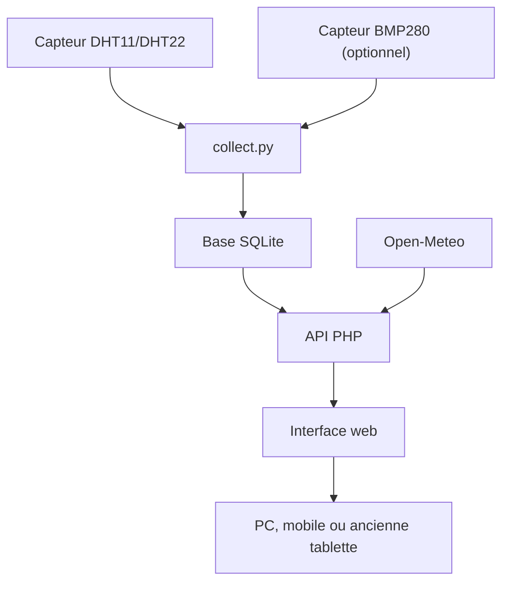
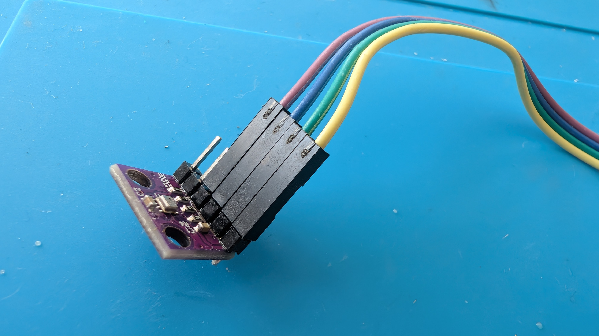
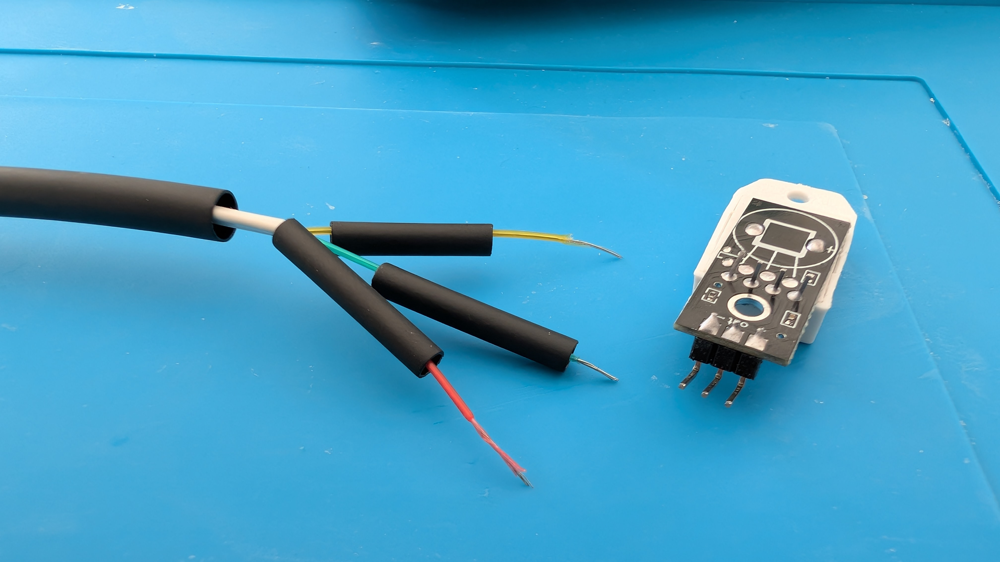
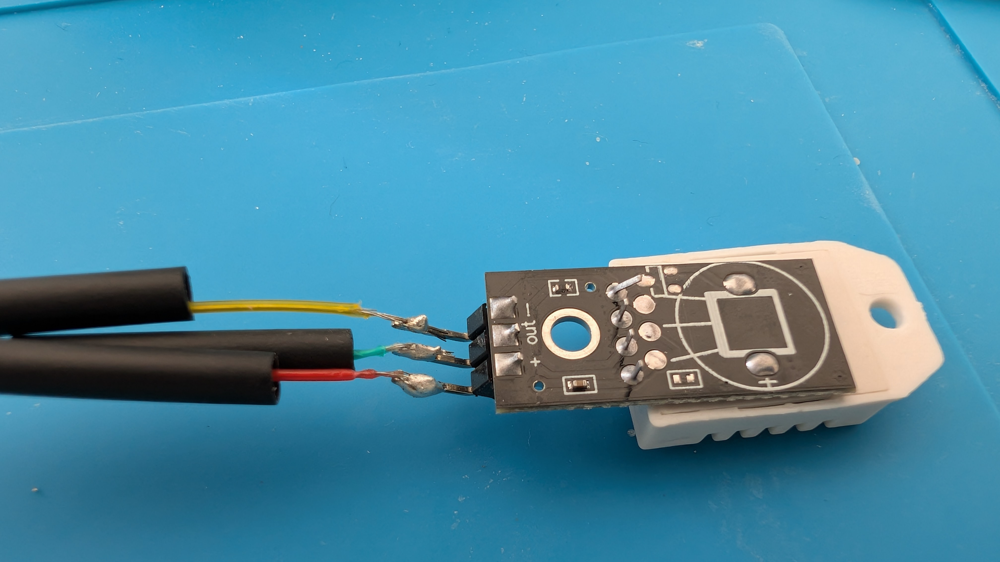
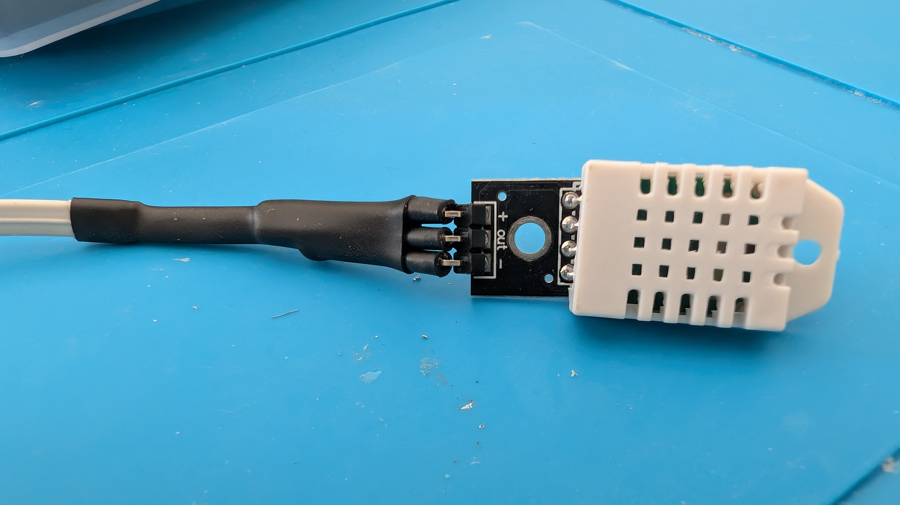
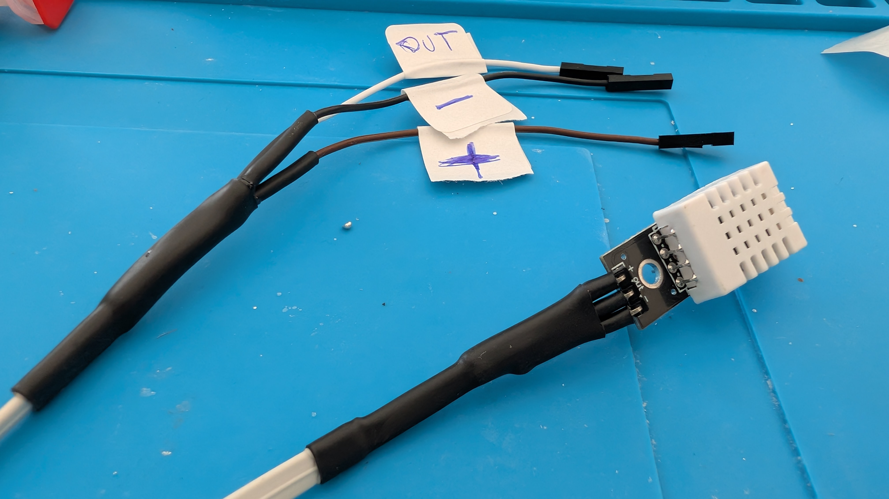
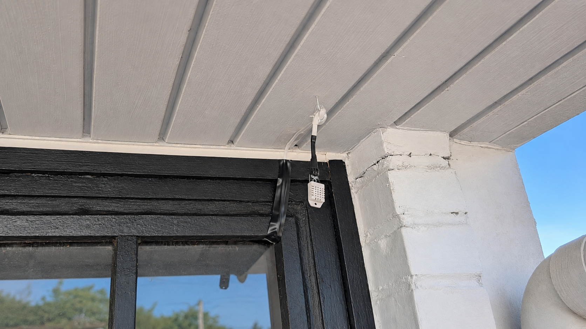
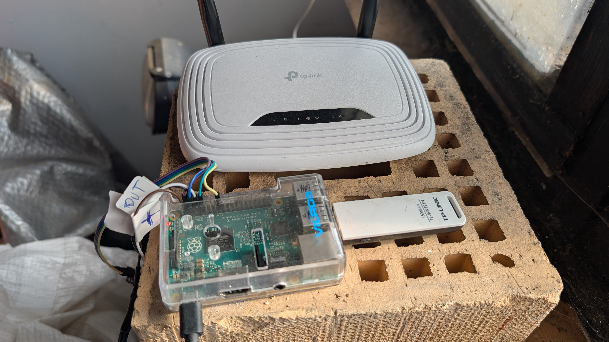

# Station météo Raspberry Pi : opération vide-tiroirs !


Tout est parti d'un constat très scientifique : chez moi, j'avais un **Raspberry Pi 2B**, une vieille **clé Wi-Fi**, un **iPad Air sous iOS 12.5.7**, un ancien câble téléphonique RJ11 et quelques composants qui dormaient tranquillement dans mes tiroirs.

Plutôt que de les laisser poursuivre leur carrière de ramasse-poussière, j'ai décidé d'en faire une station météo locale. Elle mesure la température, l'humidité et la pression, conserve un historique, affiche les prévisions, la qualité de l'air, les pollens, les informations solaires et transforme un ancien écran (iPad, tablette Android, etc.) en écran permanent.

Le Raspberry Pi possède bien une prise Ethernet, mais le prototype avait déjà été configuré en Wi-Fi, avec son adresse réservée dans la box, et je n'avais franchement pas envie de tout refaire. En plus, une ancienne clé Wi-Fi TP-Link attendait justement son heure de gloire dans un tiroir. Elle est vieille, limitée au Wi-Fi 802.11n et ne gagnera aucun concours de vitesse, mais pour envoyer quelques mesures et servir une page web locale, elle est très largement suffisante. Autant qu'elle serve à quelque chose !

Le résultat n'a évidemment pas vocation à concurrencer Météo-France, mais il est plutôt complet pour un projet fabriqué essentiellement avec ce que j'avais déjà sous la main.


## Nouveautés v2

- **Baromètre BMP280** : pression atmosphérique en temps réel avec tendance (hausse/baisse/stable), historique 24h, prévision météo déduite de la pression (orage/pluie/dégagement), min/max 24h.
- **Indicateur qualité de l'air** sur la page principale (AQI européen + niveau coloré).
- **Précision pluie** : distingue la pluie réelle (mm > 0) du simple risque (probabilité ≥ 30% sans précipitations).
- **Flèches SVG** sur le bloc baromètre (blanches, visibles jour et nuit).
- **Page Baromètre dédiée** : graphique canvas 24h, Δ1h/Δ3h/Δ24h, position dans l'intervalle min/max, prévision colorée.
- **Boutons auto-masquants** : les boutons de navigation disparaissent après 30 secondes d'inactivité (fondu 1s).
- **Mode économie par défaut** : désactive les animations au démarrage, idéal pour les tablettes anciennes.
- **Icônes lune la nuit** dans le bandeau horaire et les prévisions.
- **Manifest PWA** : installable sur l'écran d'accueil (manifest.json + icône SVG).

## Démonstration


## Ce qu'elle sait faire

### Mesures et données
- mesure locale de la **température** et de l'**humidité** avec un DHT11 ou DHT22 ;
- **baromètre BMP280** en option (pression atmosphérique) ;
- collecte automatique environ toutes les 5 minutes ;
- stockage des mesures dans une base SQLite ;
- **mesure instantanée** à la demande (bouton Mesurer), sans enregistrement ;
- calcul du **point de rosée** ;
- catégorie d'humidité (sec, modéré, humide, très humide) ;
- affichage de la **température CPU** du Raspberry Pi.

### Pages et navigation
- **page principale** : température, humidité, point de rosée, baromètre, qualité de l'air, prévisions horaires, pluie ;
- **page Statistiques** : min, moyenne, max sur 24h, graphiques 24h/7j/30j ;
- **page Prévisions** : prévisions horaires sur 7 jours via Open-Meteo ;
- **page Baromètre** : pression atmosphérique, tendance, graphique 24h, prévision météo ;
- **page Air et pollens** : qualité de l'air et indices de pollens ;
- **page Soleil** : lever, coucher, durée du jour, position du soleil.

### Modes d'affichage
- **animations météo** : soleil, nuages, pluie, neige, orage — adaptées aux conditions ;
- **mode nuit** : automatique selon le lever/coucher du soleil de la commune, avec bouton de basculement manuel ;
- **mode économie** : désactive les animations et particules côté navigateur, idéal sur tablettes anciennes ;
- **fond dynamique** : la couleur de fond change selon la température (chaud, doux, frais, froid).

### Fonctionnalités
- choix de la commune au premier lancement (recherche par nom) ;
- bouton de réinitialisation de la commune ;
- **PWA** : installable sur l'écran d'accueil (manifest.json) ;
- interface tactile compatible Safari iOS 12.5.7 ;
- aucun compte en ligne et aucune clé API nécessaires.

> Les mesures et l'historique restent à la maison, sur le Raspberry Pi. Seules les prévisions, la qualité de l'air et les heures de lever/coucher du soleil nécessitent Internet via Open-Meteo.

## Matériel compatible

| Raspberry Pi | Compatibilité |
|---|---|
| Raspberry Pi 2 Model B | Oui |
| Raspberry Pi 3 / 3B+ | Oui |
| Raspberry Pi 4 Model B | Oui |
| Raspberry Pi 5 | Oui |
| Raspberry Pi Zero / Zero 2 | Oui |
| Raspberry Pi 1 | Non supporté |

| Composant | Rôle |
|---|---|
| DHT11 ou DHT22 sur module | Température et humidité |
| BMP280 (optionnel) | Baromètre I2C |
| Carte microSD (8 Go min) | Système et base SQLite |
| Alimentation USB-C ou micro-USB | Pour le Raspberry Pi |

## Principe de fonctionnement



Le service `meteo-v2.service` garde `collect.py` éveillé. Le script lit le capteur sur le GPIO, puis ajoute une mesure à SQLite environ toutes les cinq minutes. Apache et PHP transforment ensuite ces données en JSON pour l'interface web.

Si un BMP280 est connecté, la pression atmosphérique est enregistrée en même temps que la température et l'humidité. L'API `pressure` calcule également la tendance (hausse/baisse/stable) en comparant la pression actuelle à la moyenne des mesures il y a 3 heures, et propose une prévision météo basée sur l'évolution de la pression.

Le bouton **Mesurer** utilise `live_read.py`. Il permet de satisfaire immédiatement le classique « oui, mais combien fait-il maintenant ? ». Cette lecture actualise l'écran sans être enregistrée : les statistiques restent basées uniquement sur les mesures automatiques.

---

# Partie 1 — Câblage et installation matérielle

## Étape 1 — Brancher le DHT22 (ou DHT11)

| Capteur | Raspberry Pi | Broche physique | Rôle |
|---|---|---|---|
| `+` / VCC | 3,3 V | 1 | Alimentation |
| `OUT` / DATA | GPIO 4 | 7 | Données |
| `−` / GND | GND | 6 | Masse |


> Ajouter une résistance pull-up de 4.7kΩ entre DATA et VCC si le module ne l'a pas intégrée. Dans mon cas (module DHT22 avec PCB bleu), elle est déjà présente. Vérifiez le marquage de votre module : l'ordre des broches peut varier selon le fabricant.

## Étape 2 — Brancher le BMP280 (optionnel)

| BMP280 | Raspberry Pi | Broche physique | Rôle |
|---|---|---|---|
| VCC | 3,3 V | 1 | Alimentation |
| GND | GND | 6 | Masse |
| SCL | GPIO 3 (SCL) | 5 | Horloge I2C |
| SDA | GPIO 2 (SDA) | 3 | Données I2C |



> Le BMP280 nécessite l'activation du bus I2C. L'installateur s'en charge automatiquement. Une règle udev est ajoutée pour permettre au serveur web (www-data) d'accéder au bus I2C.

## Étape 3 — Préparer le câble récupéré

J'avais chez moi un ancien câble téléphonique RJ11 d'environ cinq mètres qui ne servait plus. Pour relier le capteur, inutile d'acheter un câble neuf : celui-ci possède quatre conducteurs et le DHT22 n'en demande que trois — alimentation, données et masse. Il fait parfaitement l'affaire. Le quatrième fil reste inutilisé et profite simplement de la promenade jusqu'au capteur.



Les raccords sont soudés, puis chaque conducteur est isolé avec de la gaine thermorétractable. Les soudures ne gagneront peut-être pas le premier prix d'un concours d'électronique, mais elles tiennent, elles conduisent le courant et elles sont correctement isolées : contrat rempli.





Le repérage `+`, `OUT` et `−` évite de jouer à la loterie au moment du branchement final.



## Étape 4 — Côté Raspberry Pi


## Étape 5 — Installer le capteur à l'extérieur

Le capteur doit être placé :

- à l'ombre ;
- à l'abri de la pluie directe ;
- dans un endroit ventilé ;
- loin d'un mur, d'une toiture ou d'un appareil qui accumule de la chaleur.

Ici, il est installé sous un avant-toit. La fixation fait appel à une technologie de pointe disponible dans presque tous les tiroirs : un crochet et du ruban adhésif. Ce n'est pas très académique, mais le capteur est maintenu, protégé de la pluie et du soleil direct, tout en restant ventilé.



Le Raspberry Pi reste à l'intérieur, près du routeur, avec les deux capteurs raccordés.



---

# Partie 2 — Installation logicielle

## Étape 1 — Cloner le dépôt et lancer l'installateur

L'installateur automatise tout. Plus besoin de taper vingt commandes à la main :

```bash
git clone -b v2 https://github.com/jpparein/raspberry-pi-station-meteo.git station-meteo
cd station-meteo
bash install.sh
```

## Étape 2 — Ce que fait l'installateur

1. Détecte automatiquement le capteur (DHT11, DHT22, BMP280) ;
2. Installe les dépendances (Apache, Python, venv) ;
3. Active I2C si un BMP280 est détecté ;
4. Configure le service systemd ;
5. Démarre la station.

## Donner une seconde vie à un ancien écran

1. Ouvrez l'adresse de la station dans le navigateur de la tablette.
2. Utilisez le menu de partage.
3. Choisissez **Sur l'écran d'accueil**.
4. Lancez ensuite l'icône créée.

Que ce soit un ancien iPad sous iOS 12, une tablette Android ancienne ou un simple téléphone, l'interface utilise `XMLHttpRequest`, des préfixes `-webkit-` et une syntaxe compatible avec les navigateurs datant.

## Commandes utiles

```bash
# Statut du service
sudo systemctl status meteo-v2

# Logs en temps réel
sudo journalctl -u meteo-v2 -f

# Redémarrer le service
sudo systemctl restart meteo-v2

# Lecture instantanée du capteur
python3 scripts/live_read.py

# Vérifier la base de données
sqlite3 data/meteo.db "SELECT * FROM mesures ORDER BY id DESC LIMIT 5;"

# Tester le baromètre
python3 scripts/bmp280_read.py
```

## Désinstallation

```bash
bash uninstall.sh
```

## Dépannage

### Aucune mesure ne s'affiche

```bash
sudo systemctl status meteo-v2 --no-pager
sudo journalctl -u meteo-v2 -n 50 --no-pager
python3 scripts/live_read.py
```

Vérifiez le câblage (3.3V, GND, GPIO 4). Dans la majorité des cas, le logiciel n'est pas vexé : c'est simplement un fil qui l'est.

### Le service ne démarre pas

```bash
sudo journalctl -u meteo-v2 -n 50
```

### Apache ne fonctionne pas

```bash
sudo systemctl status apache2
sudo apache2ctl configtest
```

### Activer I2C (pour BMP280)

Si l'installateur n'a pas réussi à activer I2C, voici la procédure manuelle :

```bash
# Option 1 : via raspi-config
sudo raspi-config
# Interface Options → I2C → Enable
sudo reboot

# Option 2 : manuellement
echo "dtparam=i2c_arm=on" | sudo tee -a /boot/firmware/config.txt
sudo reboot
```

Vérification après redémarrage :

```bash
# Vérifier que le bus I2C existe
ls /dev/i2c-*

# Scanner le bus (le BMP280 doit apparaître à 0x76 ou 0x77)
i2cdetect -y 1
```

### Le BMP280 n'est pas détecté

```bash
# Vérifier que I2C est activé
ls /dev/i2c-*

# Scanner le bus
i2cdetect -y 1
```

Le BMP280 doit apparaître à l'adresse `0x76` ou `0x77`. Si ce n'est pas le cas, vérifiez le câblage SDA/SCL et l'alimentation 3.3V.

### Le BMP280 affiche des valeurs aberrantes

Vérifiez l'endianness : le BMP280 stocke les données en petit-boutiste (LSB en premier). Le script `bmp280_read.py` gère automatiquement ce format. Si vousutilisez un autre script, assurez-vous de bien convertir les octets.

### Les prévisions sont absentes ou incorrectes

- vérifiez l'accès Internet du Raspberry Pi ;
- vérifiez la commune affichée dans l'interface ;
- utilisez le bouton de réinitialisation pour choisir une autre commune.

### La page affiche une ancienne version

L'application envoie des en-têtes anti-cache, mais Safari peut conserver des anciens fichiers. Fermez complètement l'application, rouvrez-la, puis videz les données Safari si nécessaire.

### La qualité de l'air ne s'affiche pas

L'indicateur de qualité de l'air nécessite une connexion Internet (données Open-Meteo). Vérifiez que le Raspberry Pi est connecté et que la localisation est configurée.

## API disponible

| Action | Méthode | Description |
|---|---|---|
| `current` | GET | Dernière mesure automatique (température, humidité, timestamp) |
| `live` | GET | Mesure instantanée non enregistrée (DHT22) |
| `forecast` | GET | Prévisions horaires 7 jours (Open-Meteo) |
| `stats_24h` | GET | Statistiques min/moy/max sur 24h |
| `chart_24h` | GET | Données du graphique 24h (température + humidité) |
| `chart_7j` | GET | Données du graphique 7 jours |
| `chart_30j` | GET | Données du graphique 30 jours |
| `sensor_status` | GET | État du collecteur (en ligne / âge) |
| `cpu_temp` | GET | Température du processeur Raspberry Pi |
| `pressure` | GET | Pression BMP280 + tendance + prévision |
| `air_quality` | GET | Qualité de l'air européenne (AQI, PM2.5, PM10, ozone) |
| `location` | GET | Localisation configurée |
| `location_search&q=...` | GET | Recherche de commune (géocodage) |
| `location_save` | POST | Enregistrement de la commune |
| `location_reset` | POST | Suppression de la commune |

### Réponse `pressure`

```json
{
  "ok": true,
  "hpa": 1017.4,
  "temp": 31.5,
  "trend": "up",
  "delta": 1.2,
  "delta1h": 0.8,
  "delta24h": -0.5,
  "note": "Amelioration probable",
  "forecast": "degage",
  "min24": 1015.2,
  "max24": 1018.1,
  "samples": 26,
  "history": [{"t": 1786875385, "h": 1017.57}]
}
```

- `trend` : `up` (hausse ≥ 1 hPa/3h), `down` (baisse ≤ -1 hPa/3h), `stable`, `na` (pas assez de données)
- `forecast` : `orage`, `pluie`, `degage`, `degradation`, `stabilite`
- `history` : tableau des mesures 24h (timestamp + hPa) pour le graphique

### Réponse `air_quality`

```json
{
  "ok": true,
  "aqi": 24,
  "level": "Moyen",
  "cls": "aq-moy",
  "pm25": 4.2,
  "pm10": 7.5,
  "ozone": 61
}
```

### Exemples

```bash
curl -s "http://localhost/meteo/api.php?action=current"
curl -s "http://localhost/meteo/api.php?action=pressure"
curl -s "http://localhost/meteo/api.php?action=air_quality"
curl -s "http://localhost/meteo/api.php?action=stats_24h"
```

## Crédits

Projet réalisé par **Jean-Philippe Parein** avec beaucoup de matériel récupéré, quelques soudures et une quantité raisonnable de « tant qu'à faire… ».

- Prévisions et géocodage : [Open-Meteo](https://open-meteo.com/)
- Qualité de l'air : [Open-Meteo Air Quality API](https://open-meteo.com/en/docs/air-quality-api)
- Pilote du capteur : [Adafruit CircuitPython DHT](https://github.com/adafruit/Adafruit_CircuitPython_DHT)
- Plateforme : [Raspberry Pi](https://www.raspberrypi.com/)

## Licence

Le code source est distribué sous licence MIT. Consultez le fichier [LICENSE](LICENSE).
