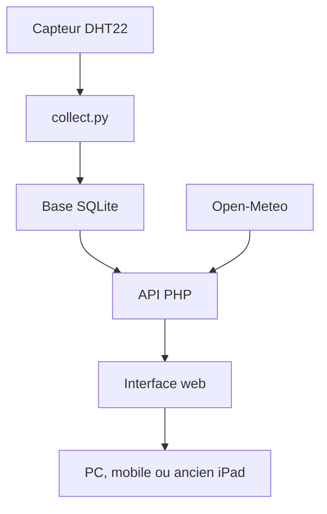

# Station météo Raspberry Pi : opération vide-tiroirs !


Tout est parti d'un constat très scientifique : chez moi, j'avais un **Raspberry Pi 2B**, une vieille **clé Wi-Fi**, un **iPad Air sous iOS 12.5.7**, un ancien câble téléphonique RJ11 et quelques composants qui dormaient tranquillement dans mes tiroirs.

Plutôt que de les laisser poursuivre leur carrière de ramasse-poussière, j'ai décidé d'en faire une station météo locale avec un capteur **DHT22 / AM2302**. Elle mesure la température et l'humidité, conserve un historique, affiche les prévisions et transforme l'ancien iPad en écran permanent.

Le résultat n'a évidemment pas vocation à concurrencer Météo-France, mais il est plutôt complet pour un projet fabriqué essentiellement avec ce que j'avais déjà sous la main.


## Démonstration


## Ce qu'elle sait faire

- mesure locale de la température et de l'humidité avec un DHT22 ;
- collecte automatique environ toutes les 5 minutes ;
- stockage des mesures dans une base SQLite ;
- mesure instantanée à la demande, sans l'enregistrer dans l'historique ;
- statistiques sur 24 heures et graphiques sur 24 heures, 7 jours et 30 jours ;
- prévisions horaires fournies par Open-Meteo ;
- choix de la commune au premier lancement ;
- mode nuit automatique selon le lever et le coucher du soleil locaux ;
- animations adaptées à la météo : soleil, nuages, pluie, neige et orage ;
- catégorie d'humidité et calcul du point de rosée ;
- affichage discret de la température du processeur du Raspberry Pi ;
- interface tactile compatible avec Safari sous iOS 12.5.7 ;
- aucun compte en ligne et aucune clé API nécessaires.

> Les mesures et l'historique restent à la maison, sur le Raspberry Pi. Seules les prévisions et les heures de lever/coucher du soleil nécessitent Internet via Open-Meteo.

## Matériel utilisé

| Élément | Utilisation |
|---|---|
| Raspberry Pi 2 Model B | Serveur, acquisition et stockage |
| Carte microSD 32 Go | Système et base SQLite |
| DHT22 / AM2302 sur module | Température et humidité |
| Ancien câble téléphonique RJ11 d'environ 5 m | Déport du capteur avec 3 de ses 4 fils |
| Vieille clé Wi-Fi USB TP-Link | Connexion réseau : pas rapide, mais largement suffisante |
| Boîtier transparent | Protection du Raspberry Pi |
| Ancien iPad Air, iOS 12.5.7 | Écran tactile de la station |


## Principe de fonctionnement



Le principe reste assez simple : le service `meteo-v2.service` garde `collect.py` éveillé pendant que nous dormons. Le script lit le capteur sur le GPIO 4, puis ajoute une mesure à SQLite environ toutes les cinq minutes. Apache et PHP transforment ensuite ces données en JSON pour l'interface web.

Le bouton **Mesurer** utilise `live_read.py`. Il permet de satisfaire immédiatement le classique « oui, mais combien fait-il maintenant ? ». Cette lecture actualise l'écran sans être enregistrée : les statistiques restent basées uniquement sur les mesures automatiques.

## Branchement du DHT22 — trois fils, pas un de plus

Le module utilisé possède trois broches : `+`, `OUT` et `−`.

| DHT22 | Raspberry Pi | Broche physique | Rôle |
|---|---|---|---|
| `+` / VCC | 3,3 V | 1 | Alimentation |
| `OUT` / DATA | GPIO 4 | 7 | Données |
| `−` / GND | GND | 6 | Masse |


Le module DHT22 visible sur les photos intègre déjà son électronique de support. Vérifiez néanmoins le marquage de votre propre module : l'ordre des broches peut varier selon le fabricant.


### Préparation du câble récupéré

J'avais chez moi un ancien câble téléphonique RJ11 d'environ cinq mètres qui ne servait plus. Pour relier le capteur, inutile d'acheter un câble neuf : celui-ci possède quatre conducteurs et le DHT22 n'en demande que trois — alimentation, données et masse. Il fait parfaitement l'affaire. Le quatrième fil reste inutilisé et profite simplement de la promenade jusqu'au capteur.


Les raccords sont soudés, puis chaque conducteur est isolé avec de la gaine thermorétractable. Les soudures ne gagneront peut-être pas le premier prix d'un concours d'électronique, mais elles tiennent, elles conduisent le courant et elles sont correctement isolées : contrat rempli.


Le repérage `+`, `OUT` et `−` évite de jouer à la loterie au moment du branchement final.


### Côté Raspberry Pi


## Installation extérieure

Le capteur doit être placé :

- à l'ombre ;
- à l'abri de la pluie directe ;
- dans un endroit ventilé ;
- loin d'un mur, d'une toiture ou d'un appareil qui accumule de la chaleur.

Ici, il est installé sous un avant-toit. La fixation fait appel à une technologie de pointe disponible dans presque tous les tiroirs : un crochet et du ruban adhésif. Ce n'est pas très académique, mais le capteur est maintenu, protégé de la pluie et du soleil direct, tout en restant ventilé.


Le Raspberry Pi reste à l'intérieur, près du routeur, posé sur une brique — un support sans ventilateur, sans vis et garanti totalement compatible avec le Raspberry Pi 2B.


## Installation logicielle

L'installateur automatise tout. Plus besoin de taper vingt commandes à la main :

```bash
git clone -b v2 https://github.com/jpparein/raspberry-pi-station-meteo.git station-meteo
cd station-meteo
bash install.sh
```

L'installateur va :
1. Détecter automatiquement le capteur (DHT11, DHT22, BMP280) ;
2. Installer les dépendances (Apache, Python, venv) ;
3. Configurer le service systemd ;
4. Démarrer la station.

## Donner une seconde vie à l'ancien iPad

1. Ouvrez l'adresse de la station dans Safari sur l'iPad.
2. Utilisez le menu de partage.
3. Choisissez **Sur l'écran d'accueil**.
4. Lancez ensuite l'icône créée.

L'iPad est ancien, Safari aussi, et tous deux ont parfois des opinions très arrêtées sur le JavaScript moderne. L'interface utilise donc `XMLHttpRequest`, des préfixes `-webkit-` et une syntaxe compatible avec iOS 12.5.7.

## Commandes utiles

```bash
# Statut du service
sudo systemctl status meteo-v2

# Logs en temps réel
sudo journalctl -u meteo-v2 -f

# Redémarrer le service
sudo systemctl restart meteo-v2

# Lecture instantanée du capteur
python3 scripts/live_read.py
```

## Désinstallation

```bash
bash uninstall.sh
```

## Dépannage

### Aucune mesure ne s'affiche

```bash
sudo systemctl status meteo-v2 --no-pager
sudo journalctl -u meteo-v2 -n 50 --no-pager
python3 scripts/live_read.py
```

Vérifiez le câblage (3.3V, GND, GPIO 4). Dans la majorité des cas, le logiciel n'est pas vexé : c'est simplement un fil qui l'est.

### Le service ne démarre pas

```bash
sudo journalctl -u meteo-v2 -n 50
```

### Apache ne fonctionne pas

```bash
sudo systemctl status apache2
sudo apache2ctl configtest
```

### Les prévisions sont absentes ou incorrectes

- vérifiez l'accès Internet du Raspberry Pi ;
- vérifiez la commune affichée dans l'interface ;
- utilisez le bouton de réinitialisation pour choisir une autre commune.

## Crédits

Projet réalisé par **Jean-Philippe Parein** avec beaucoup de matériel récupéré, quelques soudures et une quantité raisonnable de « tant qu'à faire… ».

- Prévisions et géocodage : [Open-Meteo](https://open-meteo.com/)
- Pilote du capteur : [Adafruit CircuitPython DHT](https://github.com/adafruit/Adafruit_CircuitPython_DHT)
- Plateforme : [Raspberry Pi](https://www.raspberrypi.com/)

## Licence

Le code source est distribué sous licence MIT. Consultez le fichier [LICENSE](LICENSE).
